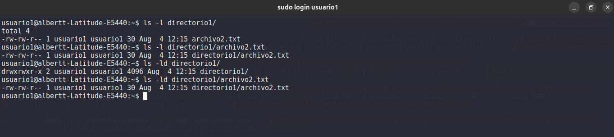

# Tarea

<details>
<summary><strong>Parte 1: Gestión de Usuarios</strong></summary>

1. **Creación de Usuarios**

```bash
sudo adduser1
sudo adduser2
sudo adduser3
```

   

2. **Asignación de Contraseñas**

   ``` bash
   sudo passwd usuario1
   sudo passwd usuario2
   sudo passwd usuario3
   ```

  

3. **Información de Usuarios**

  ```bash
  id usuario1
  ```

  

4. **Eliminación de Usuarios**

  ```bash
  sudo userdel usuario3
```

  
</details>

<details>
<summary><strong>Parte 2: Gestión de Grupos</strong></summary>

1. **Creación de Grupos**

  ```bash
  sudo groupadd grupo1
  sudo groupadd grupo2
```

  

2. **Agregar Usuarios a Grupos**
  
  ``` bash
  sudo usermod -a -G grupo1 usuario1
  sudo usermod -a -G grupo2 usuario2
```

  

3. **Verificar Membresía**
  
  ```bash
  groups usuario1
  groups usuario2
```

  
4. **Eliminar Grupo**

  ```bash
  grouodel grupo2
```

  

</details>

<details>
<summary><strong>Parte 3: Gestión de Permisos</strong></summary>

1. **Creación de Archivos y Directorios**
   - [ ] Como `usuario1`, crear un archivo llamado `archivo1.txt` en su directorio principal y escribir algo en él.

  ```bash
  sudo login usuario1
  echo "Hola desde usuario1" >> archivo1.txt
```

  

- [ ] Crear un directorio llamado `directorio1` y dentro de ese directorio, un archivo llamado `archivo2.txt`.

  ```bash
  mkdir directorio1
  echo "Hola desde archivo2" >> directorio1/archivo2.txt
  ```

  

2. **Verificar Permisos**

  ```bash
  ls -l directorio1
  ls -l directorio1/archivo2.txt
  ls -ld directorio1
  ls -ld directorio1/archivo2.txt
```

  

3. **Modificar Permisos usando `chmod` con Modo Numérico**
   - [ ] Cambiar los permisos del `archivo1.txt` para que sólo `usuario1` pueda leer y escribir (permisos `rw-`), el grupo pueda leer (permisos `r--`) y nadie más pueda hacer nada.

  ```bash
  chmod 640 archivo1.txt
```

  

4. **Modificar Permisos usando `chmod` con Modo Simbólico**

- [ ] Agregar permiso de ejecución al propietario del `archivo2.txt`.

  ```bash
  chmod u+x directorio1/archivo2.txt
  ```

  

5. **Cambiar el Grupo Propietario**
   - [ ] Cambiar el grupo propietario de `archivo2.txt` a `grupo1`.

  ```bash
  chown usuario1:grupo1 directorio1/archivo2.txt
  ```

  

6. **Configurar Permisos de Directorio**
   - [ ] Cambiar los permisos del `directorio1` para que sólo el propietario pueda entrar (permisos `rwx`), el grupo pueda listar contenidos pero no entrar (permisos `r--`), y otros no puedan hacer nada.

  ```bash
  chmod 740 directorio1
```

  

7. **Comprobación de Acceso**
   - [ ] Intentar acceder al `archivo1.txt` y `directorio1/archivo2.txt` como `usuario2`. Nota cómo el permiso de directorio afecta el acceso a los archivos dentro de él.

  ```bash
  sudo login usuario2
  cat /home/usuario1/archivo1.txt
  ls /home/usuario1/directorio1/archivo2.txt
```

  
  

8. **Verificación Final**
   - [ ] Verificar los permisos y propietario de los archivos y directorio nuevamente con `ls -l` y `ls -ld`.

  ```
  ls -ld archivo1.txt directorio1 directorio1/archivo2.txt directorio1
  ls -l archivo1.txt directorio1 directorio1/archivo2.txt directorio1
```

  
  

</details>

## Reflexión (Opcional)

Contestar las siguientes preguntas:

- [ ] ¿Por qué es importante gestionar correctamente los usuarios y permisos en un sistema operativo?

Para mantener un control sobre las acciones que puede realizar un usuario, y a que información tiene acceso, para leer, escribir y ejecutar.

- [ ] ¿Qué otros comandos o técnicas conocen para gestionar permisos en Linux?

De momento las que conozco son las que solicitamos en esta actividad.
