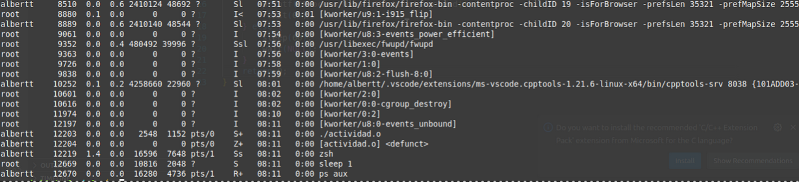

**Universidad de San Carlos de Guatemala**  
**Facultad de Ingeniería**  
**Escuela de Ciencias y Sistemas**  
**Sistemas Operativos 1**


# Actividad 6 - Procesos e Hilos


## 1. ¿Incluyendo el proceso inicial, cuántos procesos son creados por el siguiente programa?

Para este codigo se generan 8 procesos ya que cada llamada al fork duplica la cantidad de procesos generados.

## 2. Crear un proceso que se convierta zombi por 60 segundos
- Codigo generadoo para crear el proceso
 
- Id generado del proceso

- Proceso con ps aux


## 3. Completar el codigo y responder las preguntas:
### Código:
```c
pid_t pid;
pid = fork();

if (pid == 0){
    fork();
    thread_create( . . . );
}
fork();
```
- Codigo terminado

- Cuantos procesos unicos se crean:

    En este caso se crean 5 procesos ya que se crean 2 con el primer llamado 	de fork y la siguiente llamada al estar en el proceso hijo solo genera un 	proceso dándonos 3 para la tercera llamada nos crea 2 procesos más 	dando un total de 5 procesos.
- Cuantos hilos son creados: 

	En este caso solo creamos 1 hilo para este código. 