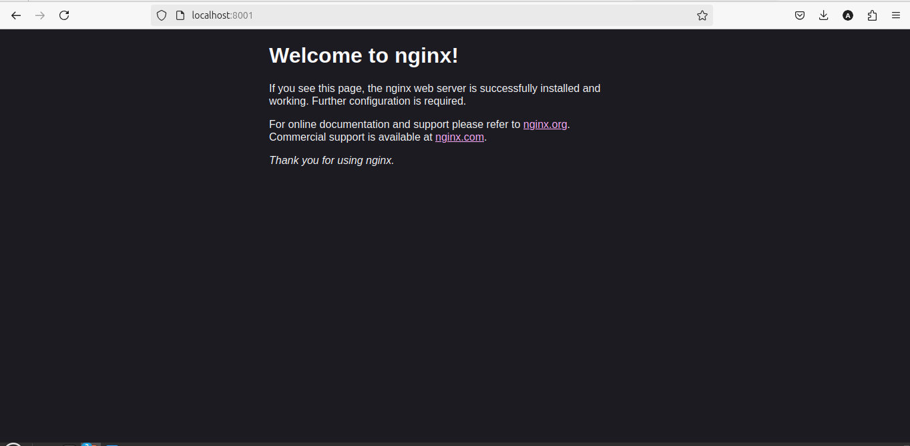
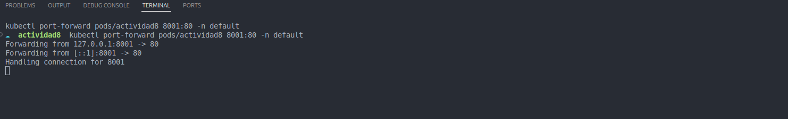

# Actividad 8: Despliegue de Nginx en Kubernetes Local
## Paso 1: Instalar Kubernetes y minikube
Utilizaremos el administrador de paquetes snap, ya que apt no tiene por defecto el repositorio de kubectl
```bash
snap install kubectl --classic
kubectl version --client
```
Ahora instalamos minikube para manejar el cluster de forma local
```bash
curl -LO https://storage.googleapis.com/minikube/releases/latest/minikube-linux-amd64
sudo install minikube-linux-amd64 /usr/local/bin/minikube && rm minikube-linux-amd64
```
## Paso 2: Iniciar el clúster local de Kubernetes

### Minikube
Si utilizas `minikube`, inicia el clúster con el siguiente comando:

```bash
minikube start
```

## Paso 3: Crear un archivo YAML para el despliegue de Nginx

Crea un archivo llamado `pod.yaml` con el siguiente contenido:

```yaml
apiVersion: v1
kind: Pod
metadata:
  name: actividad8
  labels:
    name: actividad8
    year: '2024'
spec:
  containers:
  - name: actividad8
    image: nginx:1.27.2
    resources:
      limits:
        memory: "128Mi"
        cpu: "500m"
    ports:
      - containerPort: 80
```

## Paso 3: Aplicar el despliegue en Kubernetes

Aplica el archivo de despliegue ejecutando el siguiente comando en tu clúster local:

```bash
kubectl apply -f pod.yaml
```

## Paso 4: Exponer el servicio de Nginx

Para poder acceder al servidor Nginx, expón el servicio usando:

```bash
kubectl port-forward pods/actividad8 8001:80 -n default
```

## Paso 5: Verificar el estado del despliegue

Verifica que los pods y servicios están corriendo correctamente con los siguientes comandos:

```bash
kubectl get pods
```
## Contenedor desplegado
Contenedor levantado en localhost
 

Terminal corriendo el pod con el contenedor



## Pregunta: ¿En un ambiente local de Kubernetes existen los nodos masters y workers, cómo es que esto funciona?

En modo local, estos nodos no existen de forma separada. En caso de minikube u otros, nos brindan un solo nodo que ejecuta las acciones tanto de masters como de workers, entonces por separado no existen, pero sí existe en un solo nodo para simplificar la ejecución local.